# 64131212 - Android Programming

## Giới thiệu
Đây là kho lưu trữ chứa các bài thực hành và bài tập bổ sung trong quá trình học lập trình Android. Toàn bộ mã nguồn được đẩy lên server thường xuyên để giảng viên theo dõi tiến trình.

---

## SOURCES CODE BÀI TẬP THỰC HÀNH
Dưới đây là danh sách các bài tập thực hành kèm theo hình ảnh minh họa:

### Ex1_Hello
- 📂 [Xem mã nguồn](Ex1_Hello)
- 🖼️ Hình ảnh minh họa:
  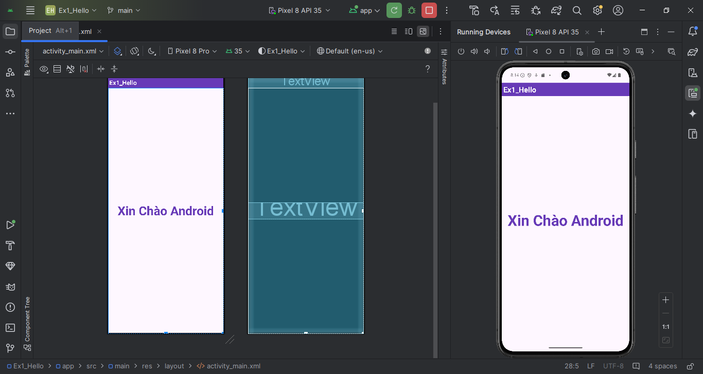

### Ex1_ConstraintLayout
- 📂 [Xem mã nguồn](Ex1_ConstraintLayout)
- 🖼️ Hình ảnh minh họa:
  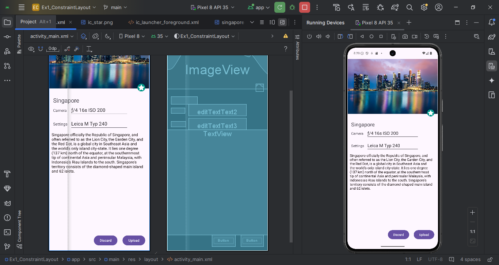

### Ex2_LinearLayout
- 📂 [Xem mã nguồn](Ex2_LinearLayout)
- 🖼️ Hình ảnh minh họa:
  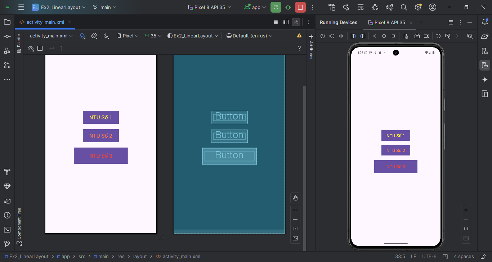

### Ex3_SimpleSumApp
- 📂 [Xem mã nguồn](Ex3_SimpleSumApp)
- 🖼️ Hình ảnh minh họa:
  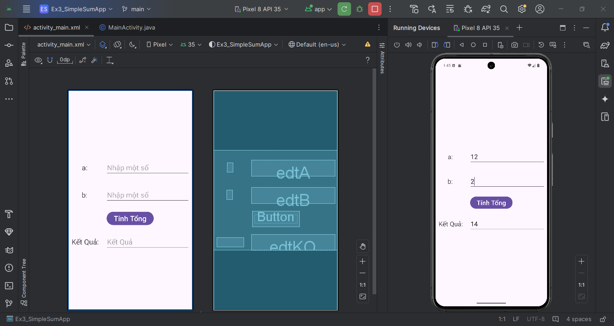

### Ex4_AddSubMulDiv_Onclick
- 📂 [Xem mã nguồn](Ex4_AddSubMulDiv_Onclick)
- 🖼️ Hình ảnh minh họa:
  

### Ex5_AddSubMulDiv_Anynomous
- 📂 [Xem mã nguồn](Ex5_AddSubMulDiv_Anynomous)
- 🖼️ Hình ảnh minh họa:
  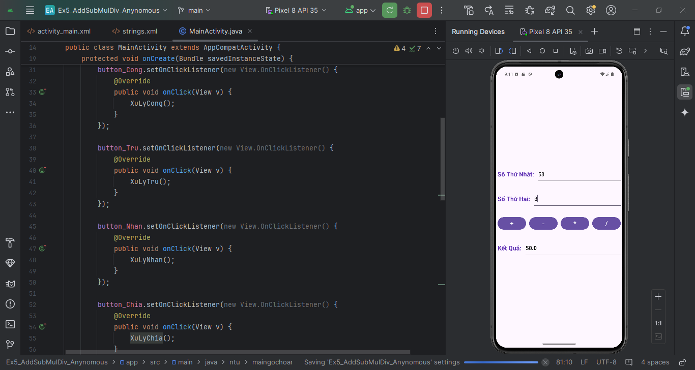

### Ex5_AddSubMulDiv_Var
- 📂 [Xem mã nguồn](Ex5_AddSubMulDiv_Var)
- 🖼️ Hình ảnh minh họa:
  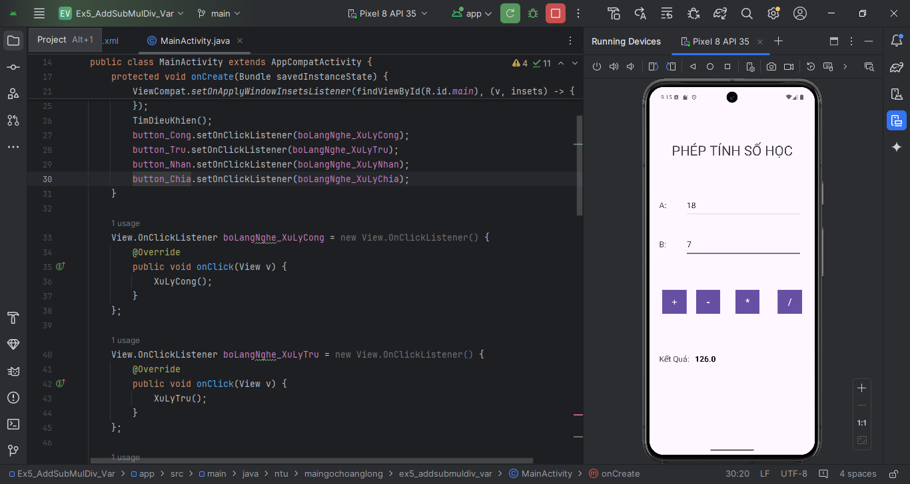

### Ex5_AddSubMulDiv_Activiy_as_Listner
- 📂 [Xem mã nguồn](Ex5_AddSubMulDiv_Activiy_as_Listner)
- 🖼️ Hình ảnh minh họa:
  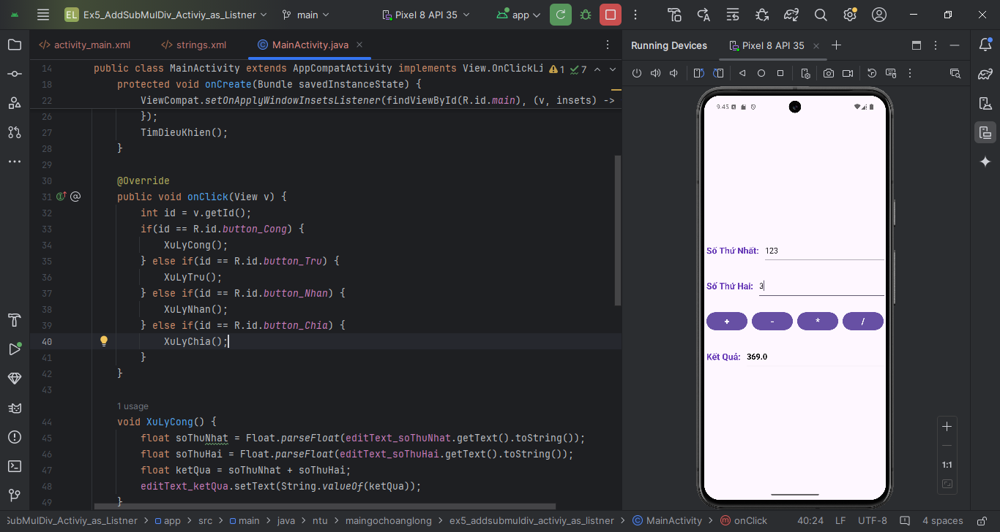

### Ex6_IntentDonGian
- 📂 [Xem mã nguồn](Ex6_IntentDonGian)
- 🖼️ Hình ảnh minh họa:
  

    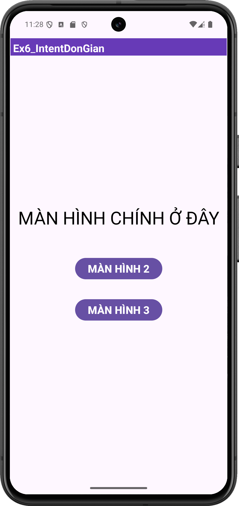
    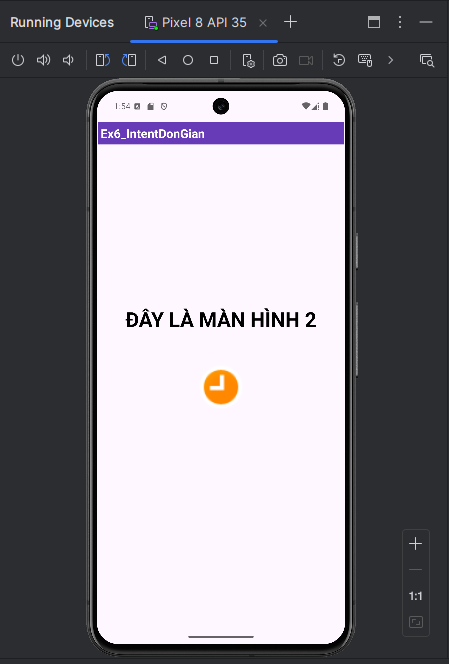
    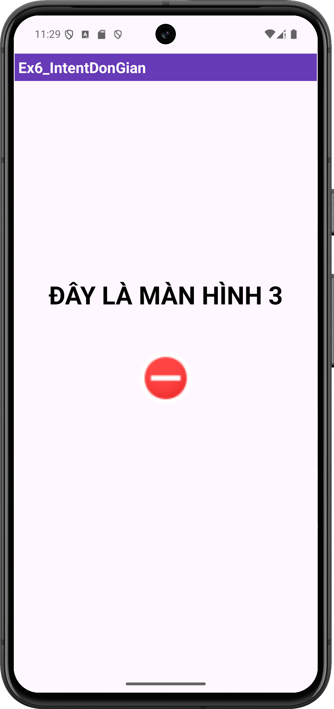
  

### Ex7_IntentLogin
- 📂 [Xem mã nguồn](Ex7_IntentLogin)
- 🖼️ Hình ảnh minh họa:
  

    
    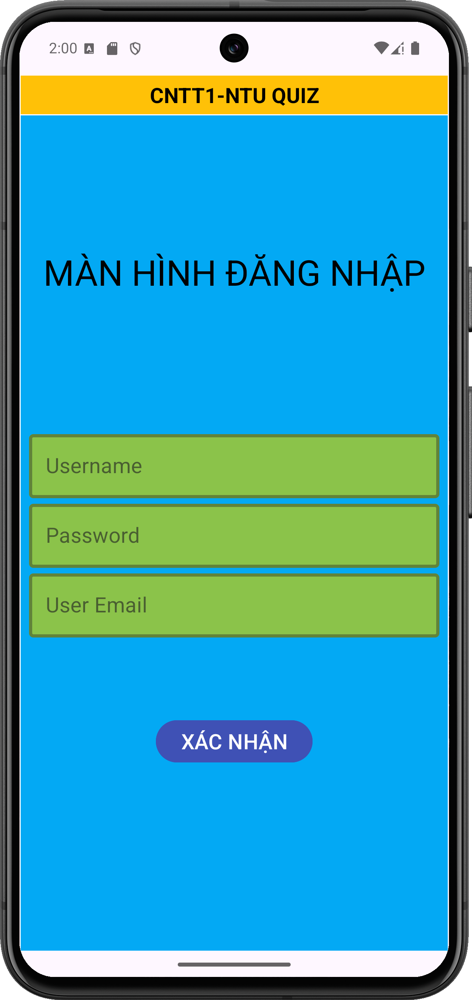
    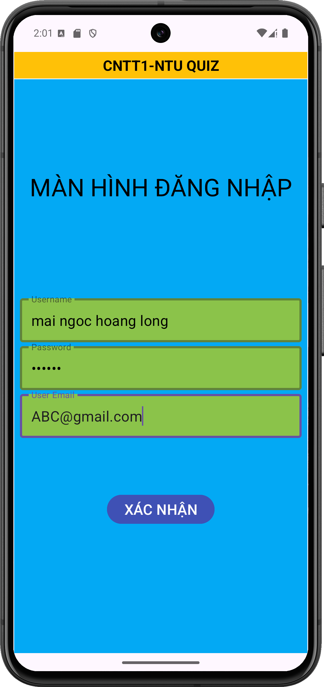
    
  

### Ex_BMI_Calculator
- 📂 [Xem mã nguồn](Ex_BMI_Calculator)
- 🖼️ Hình ảnh minh họa:
  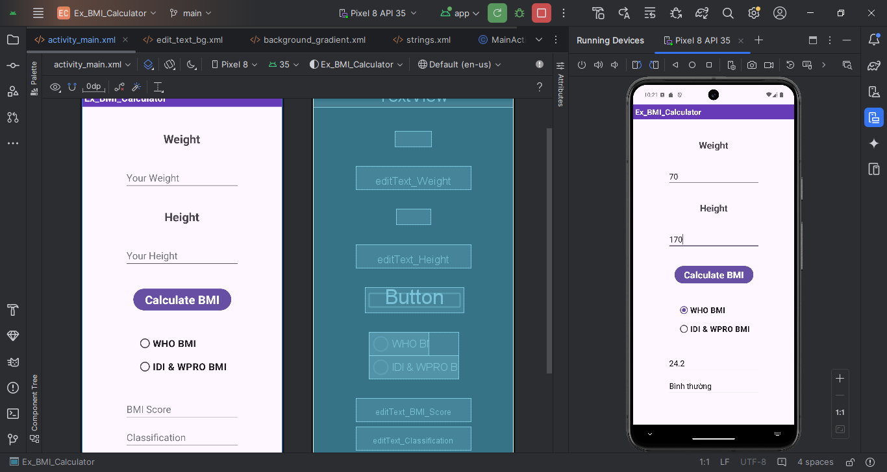

### Ex_Simple_Login_Page
- 📂 [Xem mã nguồn](Ex_Simple_Login_Page)
- 🖼️ Hình ảnh minh họa:
  

